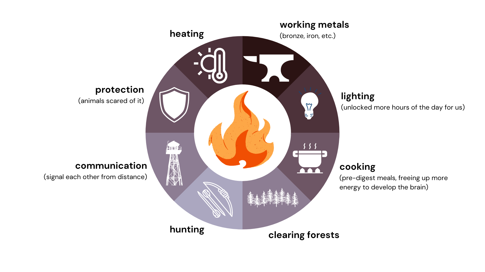
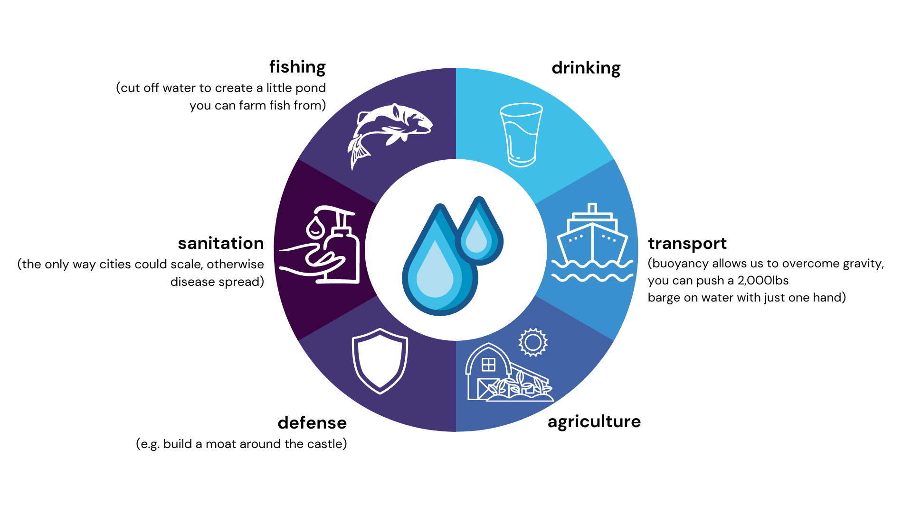

# Saylor Series: The Rise of Man Through the Stone and Iron Ages (Episode 1)

**There has never been such a thing as a fair fight.**

To become the apex predator in nature - you have to become **harder**, **smarter**, **faster**, **stronger**.

Humans achieved that through cooperation - a single human can’t be the apex predator.

# Fire
Fire was the first major technology that propelled humanity through a multitude of innovations:

# Missiles
Instead of hand-to-hand combat with bigger animals - hit them with a projectile. Never a fair fight - humans would hunt from mountains and other advantageous terrains.

# Hydraulics
Hydraulics was the third incredibly powerful technology: 

Hydraulic transport was vital in enabling **economic density** and fast-growing prosperity in the cradle of civilization - the Mediterranean.

# Evolution & Innovation
Nature always tries to sharpen its strategy to become **harder**, **smarter**, **faster**, **stronger**.

- ***evolution*** - an organic form of innovation
- ***innovation*** - an **in**organic form of evolution

Nature always pursues the most **energy-efficient** strategy - do the most with the least effort. All inventions lead toward greater economic or energetic density.

This is also why digital gold is **100x** better than gold. Gold is a rock – it never changes. Digital gold can improve on all dimensions. 

# Romans
The Roman empire lasted for 700 years!
Their most profound idea was that **leadership rotated every year**:
- common faith: people perceived they’re protecting a common good (society) versus someone’s dynasty
- every human has an ego and **wants their turn**: this removed in-fighting between powerful families
- created **competition** in the market for talent

Companies today have the same owner for decades. Decentralized organisms like Bitcoin are superior precisely because of this rotation. 

# Protocols
Protocols win out.

The Romans standardized **everything**. They built every wagon with the same parts. The railroad tracks around the world today are the exact same size as a Roman chariot.

Logistic, military, political and monetary protocols allow us to **globalize cooperation** and **free mental bandwidth** to focus on other productive things. 

Protocols experience **path dependence** - once they catch on, they have strong inertia.

# Pain and Skin In The Game
Roman aqueducts required the architects to stand beneath the bridge with their family as they removed the scaffolding - if you build it wrong, you die!
Protocols that disincentivize malperformance through embracing nature’s unforgivingness perform better.

Pain is a natural feature of life, giving you feedback and information.

When you try to cut off the pain flow through anesthetics, a bribe, or QE - you avoid paying the price and getting a lesson for your misstep. 

This sends a ripple effect throughout the system, distorting it - and ultimately will lead you to make the same mistake again.

Today, we have [Too Big To Fail institutions](https://www.2minutebitcoin.org/blog/an-honest-account-of-fiat-money-2018) interrupting this evolutionary impulse. We preserve them at all costs and do not incentivize them to learn from their mistakes. 

 ----------------------------------------------------------------------

# META
- Original Author: Michael Saylor, Robert Breedlove, Stephen Chow
- Original Word Count: 18,324
- Original Posted Date: Nov 22, 2020 (recorded) / Feb 18, 2021 (transcribed)
- Original Source: https://chowcollection.medium.com/the-saylor-series-episode-1-the-rise-of-man-through-the-stone-and-iron-ages-2da02a0bdd68
