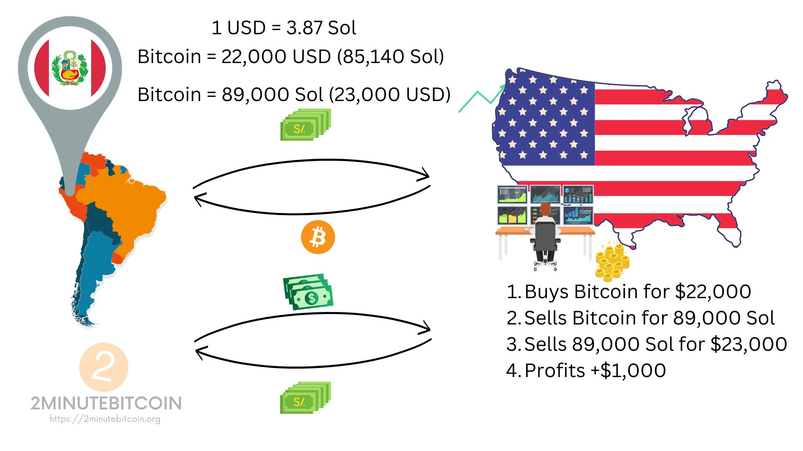
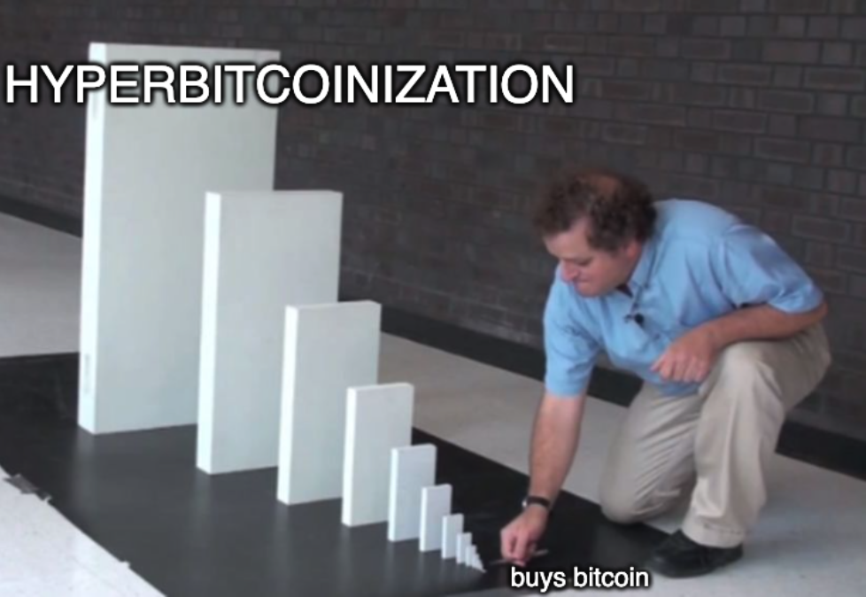

Bitcoin won't be eagerly adopted by everybody - it will be **forced upon** them by economic reality.

People will be forced to pay with bitcoins because no one will accept their **worthless fiat** for payments. [Good money](https://www.2minutebitcoin.org/blog/stone-ridge-2020-shareholder-letter#:~:text=Money%20has%20always,is%20at%20stake) drives out the bad, and this has already started as a small fiat bleed.

Historically, it has been good, strong currencies that have driven out bad, weak currencies.
All of history's dominant currencies (the denarius, florin, and pound sterling, to name a few) became dominant currencies because they were consistent, stable, and of high quality.

Bitcoins are not just good money. They are **[the best money](https://www.2minutebitcoin.org/blog/bitcoin-is-the-best-unit-of-account)**.
The Bitcoin network has the best monetary policy and the best brand.
We should therefore expect that bitcoins will drive out bad, weak currencies.

# Slow Fiat Bleed
Bitcoin's current adoption model is one of **exchange rate bubbles**. Due to group psychology, newcomers arrive in waves fuelled by two main factors:
1. ***decreasing information asymmetry*** – more resources to learn about Bitcoin -> more people are coming to the realization that bitcoins are indeed the best money.
2. ***increasing liquidity*** – buying bitcoins is more convenient and has fewer fees attached today than many years ago.

These waves result in an [extremely volatile](https://www.2minutebitcoin.org/blog/i-love-bitcoins-volatility#:~:text=Bitcoin%E2%80%99s%20volatility%20is,the%20Weimar%20hyperinflation) Bitcoin exchange rate. Regardless, once the tide pulls back and the weak hands fold, the price is a few multiples higher than before the wave.

# Speculative Attack
If one believes fiat will decrease in value and Bitcoin will rise in value, they are incentivized to take a loan in fiat and invest in Bitcoin, paying the loan back later and profiting from the difference - also called a **carry trade**.

The weaker the local currency, the more of a no-brainer it becomes to borrow it.
In this process, banks create **more** weak currency, amplifying the problem.

The immediate effect of this is that **the local** price of Bitcoin goes up. The higher local price incentivizes traders to perform **arbitrage** for profit - buy the cheaper bitcoin in foreign dollars, sell it for the more expensive local currency, then sell the local currency for dollars.
This additional sell pressure **further** weakens the local currency.

- Bitcoin market cap at $22,000 - $424B
- Peru GDP - $223B

The local central bank is powerless - it has limited tools to deal with this that cannot be applied for a prolonged period of time.

## Hyperbitcoinization
Such a speculative attack can be seen as a series of dominoes - it rapidly turns into **contagion**.

When they see the price of Bitcoin rise, citizens of countries with stronger-but-still-weak currencies buy in too. This action entails [**the same** cycle](https://www.2minutebitcoin.org/blog/bitcoin-is-about-the-money-not-the-blockchain-technology#:~:text=Money%20becomes%20more,everybody%20adopts%20it) of economic instability in their local currency. Rinse and repeat.

The feedback loop between fiat inflation and bitcoin deflation will throw the world into full hyperbitcoinization.
[Gradually, then suddenly](https://www.2minutebitcoin.org/blog/gradually-then-suddenly-bitcoin#:~:text=Because%20Bitcoin%27s%20supply%20is%20fixed%20and%20cannot%20be%20manipulated%2C%20it%20will%20eventually%20become%20the%20most%20reliable%20pricing%20mechanism%20in%20the%20world).

----------------------------------------------------------------------

# META
- Original Author: Pierre Rochard
- Original Word Count: 2073
- Original Posted Date: July 4, 2014
- Original Source: https://nakamotoinstitute.org/mempool/speculative-attack/
